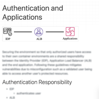

# Securing Your Collaborative Jupyter Notebooks in the Cloud using Container and Load Balancing Services

#### by Haw-minn Lu, Adrian Kwong, José Unpingco
#### Gary and Mary West Health Institute

Watch the [short introductory video](https://videos.whidsc.net/SciPy2020/ci_poster.mp4).

[Full length proceedings paper](http://conference.scipy.org/proceedings/scipy2020/72_lu.html)

For more detailed explanation, please refer to the companion paper in the Scipy 2020 Proceedings.

  

    
  
	  
  

    
  

  

    
  

  

    
  
	  
  

    
  
	  
  

    
  

PLEASE NOTE: Much of the source code is not yet deployed so many links are broken, but should be fixed within a day. You can also check all the code snippets at <a href="https://github.com/WestHealth/scipy2020/tree/master/cloud_infrastructure/supplemental_code">https://github.com/WestHealth/scipy2020/tree/master/cloud_infrastructure/supplemental_code) so please monitor this for updates</a>
