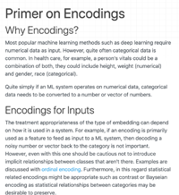
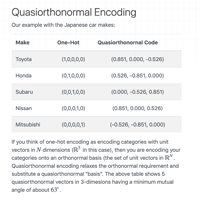
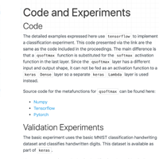

# Scipy 2020 Poster on Quasi-orthonormal Encoding for Machine Learning Applications

#### by Haw-minn Lu
#### Gary and Mary West Health Institute

Watch the [short introductory video](https://videos.whidsc.net/SciPy2020/qo_poster.mp4).

For more detailed explanation, please refer to the companion paper in the Scipy 2020 Proceedings.

  

    
  
	  
  

    
  

  

    
  

  

    
  
	  
  

    
  

